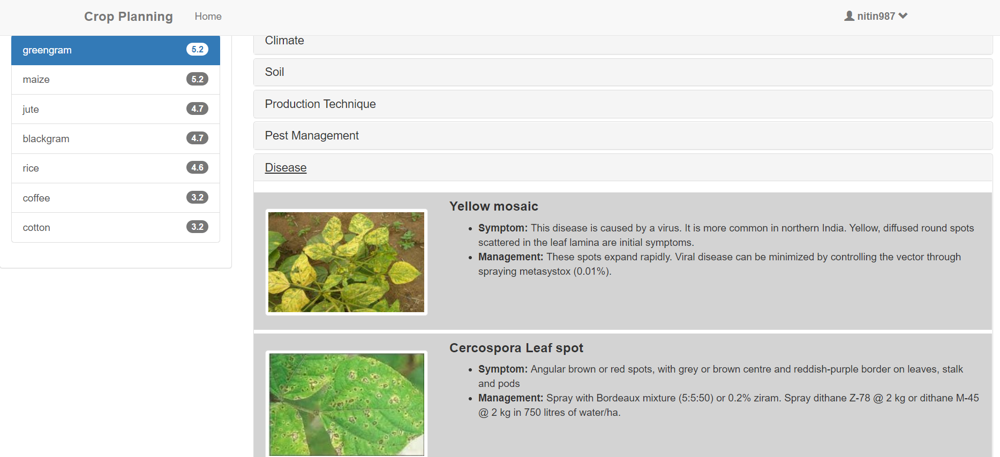

# Farmer Advisory
A  Web Portal for the purpose of helping farmers in crop planning and crop handling built as a part of Course project CS305.
The portal gives information on Crop Handling techniques (water requirements, soil type requirement, etc) as well as recommended crops based on attributes such as location. The portal also provides a discussion space for farmers and experts in the related fields.
# The Queries (Handling and Planning)
The queries are answered through Knowledge Models Graphs for each crop extracted from unstructured agricultural text. The co-reference resolution and relation extraction is done through Stanford Core NLP and Snips NLU models for intent and slots identification are fine tuned on agricultural data.
# Tech Stack
Web Server on NGINX  
Django framework for backend design  
Databases: MongoDB, MySQL and Neo4j (for graphs)  
Tornado based Runtime Push Server  
Website Design in HTML/CSS  
More information on design of the project in the Design Document: https://github.com/CS305-Group20/FarmerAdvisory/blob/master/Design%20Document%20CS305_Group20.pdf
# Some Screenshots of the Project
## Crop Planning

## Diseases and Prevention Techniques

More demo images/screenshots here: https://github.com/CS305-Group20/FarmerAdvisory/tree/master/demo-images
